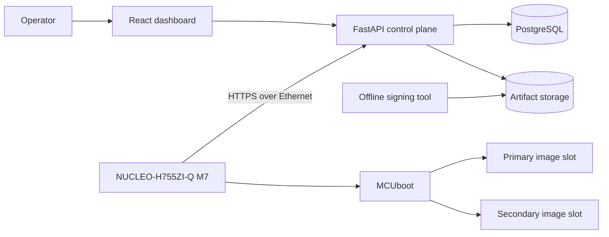

# STM32H755 OTA Platform

An educational, production-minded over-the-air firmware update platform for the
STMicroelectronics NUCLEO-H755ZI-Q. The project demonstrates the complete update
lifecycle: signed firmware creation, controlled deployment, Ethernet delivery,
trial boot, confirmation, rollback, fleet observability, and later automotive
diagnostic integration.

The first device target is the Cortex-M7 core running Zephyr with MCUboot. The
control plane uses FastAPI and PostgreSQL, and the operator dashboard uses React
and TypeScript. These choices remain subject to an early hardware feasibility
spike; unsupported assumptions are recorded as `TBD`, not treated as facts.

## Project status

**Phase 0: architecture and requirements baseline.** No firmware or service is
implemented yet.

## Intended outcomes

- A repeatable signed update from a local release service to the board over Ethernet.
- Automatic rejection of invalid, incompatible, or downgraded firmware.
- Trial boot with explicit confirmation and automatic rollback.
- Campaign management, telemetry, auditability, and a fleet simulator.
- Reproducible verification evidence, including hardware-in-the-loop tests.
- Later Wi-Fi, Cortex-M4 supervision, and UDS over DoIP extensions.

## Architecture at a glance



The physical flash addresses and slot sizes are deliberately unspecified until
the feasibility spike verifies them from the reference manual, final devicetree,
linker map, and measured binaries.

## Documentation

Start with the [documentation index](docs/INDEX.md). Important entry points:

- [Project vision](docs/PROJECT_VISION.md)
- [Scope](docs/SCOPE.md)
- [Software requirements](docs/requirements/SRS.md)
- [Software design](docs/architecture/SDD.md)
- [Threat model](docs/security/THREAT_MODEL.md)
- [Verification strategy](docs/verification/TEST_STRATEGY.md)
- [Roadmap](docs/ROADMAP.md)
- [Learning guide](docs/learning/READING_GUIDE.md)

## Engineering principles

1. The device bootloader is authoritative for image authenticity, security
   counter policy, and bootability.
2. Private signing keys never enter the firmware repository or runtime services.
3. Recovery behavior is designed and tested before feature breadth is added.
4. Hardware facts are measured and retained as evidence.
5. Requirements, design components, implementation, and tests remain traceable.
6. MISRA C:2012 informs the C coding rules, but the project does not claim formal
   compliance or safety certification.

## Repository layout

```text
docs/                 Requirements, architecture, security, verification, learning
firmware/             Zephyr application and MCUboot sysbuild integration (planned)
services/             FastAPI control plane and workers (planned)
web/                  React operator dashboard (planned)
tools/                Signing and fleet simulation tools (planned)
tests/hil/             Hardware-in-the-loop automation (planned)
```

See [CONTRIBUTING.md](CONTRIBUTING.md) before changing requirements or architecture.
