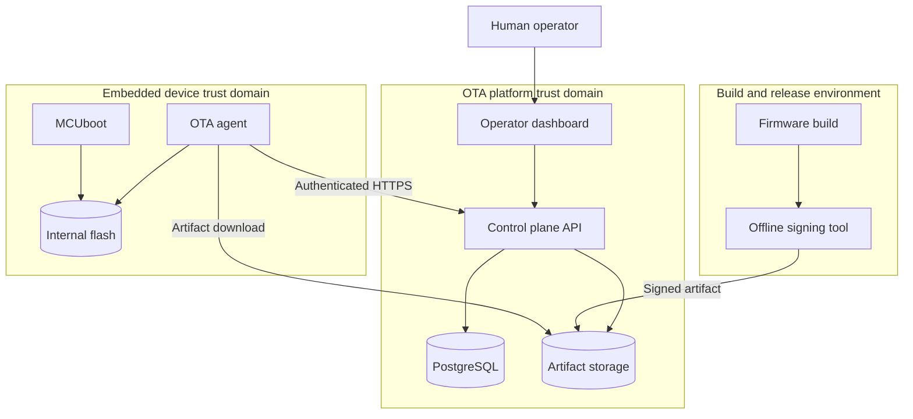

# System Context and Trust Boundaries

## Context

## Trust boundaries

| Boundary | Untrusted input | Required control |
|---|---|---|
| Operator to dashboard/API | Credentials and commands | Authentication, RBAC, validation, audit |
| Build to signing | Binary and release metadata | Reproducible identity, explicit approval, isolated key |
| Signing to artifact storage | Signed artifact | Digest verification, immutability, access control |
| Device to control plane | Identity, status, telemetry | Per-device authentication, replay controls, validation |
| Network to device | TLS records, manifest, image bytes | TLS validation, bounds checks, signed image validation |
| OTA agent to bootloader | Candidate image and pending state | MCUboot validation and authoritative boot policy |
| Application to persistent state | Confirmation and health result | Valid state transition and power-loss-safe write |

## Authority model

- The release manager controls deployment eligibility, timing, and rollout waves.
- The signing authority authorizes image content.
- MCUboot decides whether an image is authentic and bootable.
- The application decides whether its trial health checks pass.
- The backend records confirmation but cannot override local image verification.

## External dependencies

| Dependency | Role | Failure posture |
|---|---|---|
| DHCP/DNS/SNTP | Network configuration and TLS time basis | Retry with bounds; keep current image |
| Artifact storage | Firmware delivery | Abort candidate download; keep current image |
| PostgreSQL | Platform state | Fail API operation; never weaken device boot policy |
| Development CA | TLS server trust | Reject untrusted endpoint |
| ST-Link/ROM bootloader | Factory recovery | Manual procedure, outside normal OTA flow |

## Open facts

| Item | Status | Closure criterion |
|---|---|---|
| Exact Zephyr board and CPU target | TBD | Record output from installed Zephyr board inventory |
| Internal flash geometry | TBD | Cite reference manual and compare with generated DTS |
| MCUboot upgrade mode | TBD | Demonstrate trial and revert on the physical board |
| Slot sizes and margin | TBD | Retain final linker maps and measured signed binaries |
| Ethernet driver/PHY configuration | TBD | Pass sustained transfer test on the board |
