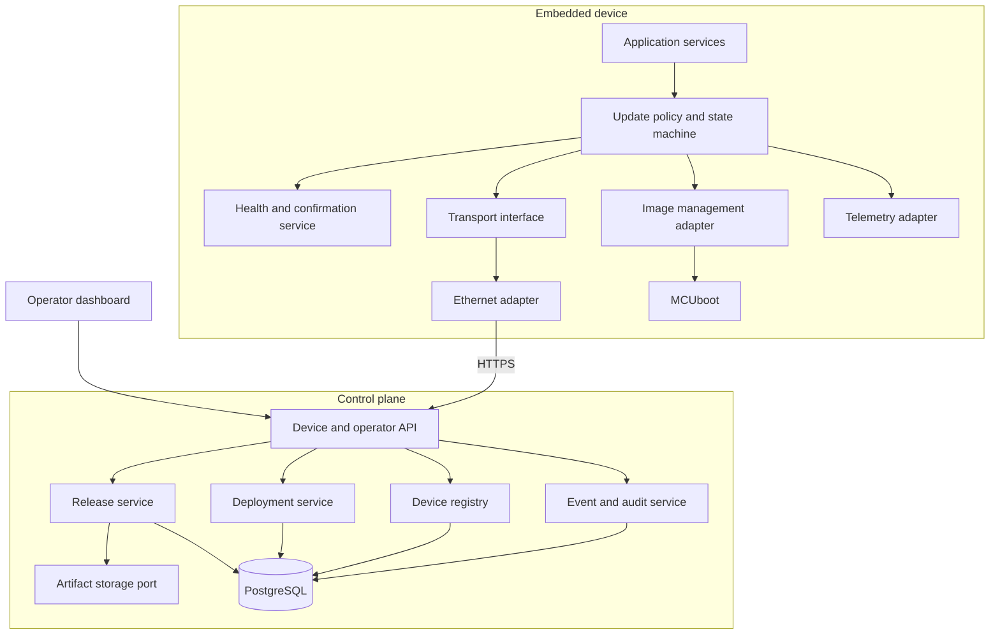
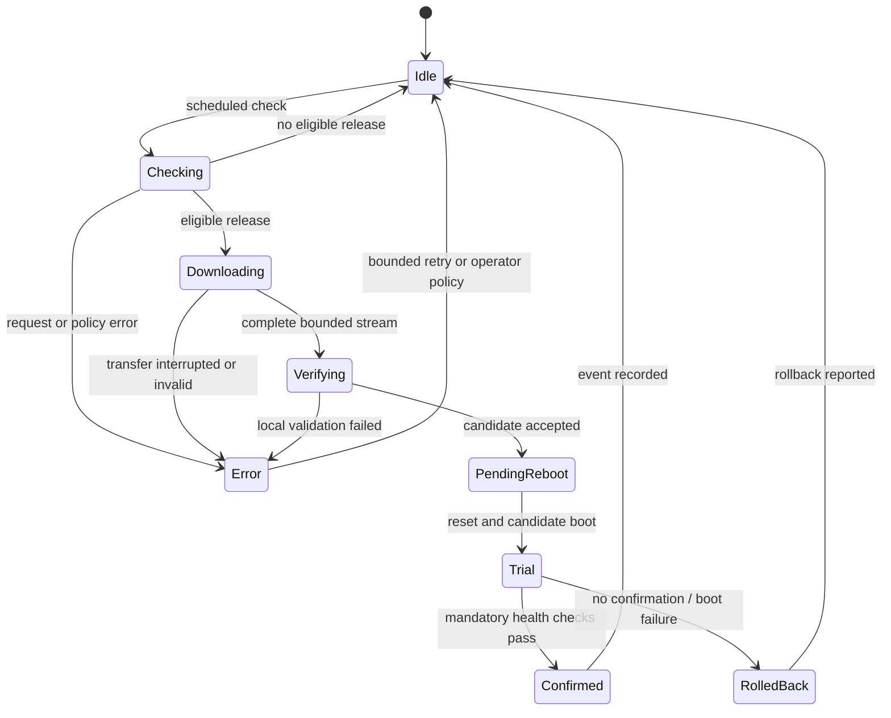
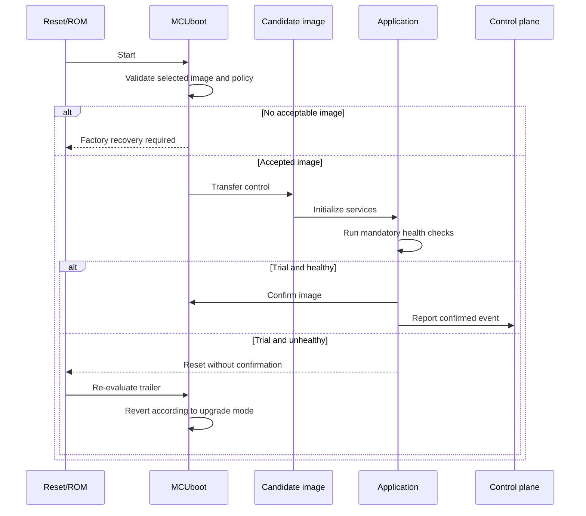

# Software Design Description

## 1. Architectural drivers

The architecture is driven by recovery, authenticity, constrained flash/RAM,
testability, and the need to add Wi-Fi and automotive diagnostics without copying
the image lifecycle. The [SRS](../requirements/SRS.md) is normative for behavior.

## 2. System decomposition



The layering resembles AUTOSAR's separation of application behavior from basic
software services, but this project does not implement or claim AUTOSAR conformance.

## 3. Embedded responsibilities

| Component | Owns | Must not own |
|---|---|---|
| Update policy | Valid transitions, retries, eligibility response handling | Ethernet driver details or signature primitives |
| Transport port | Bounded request/stream contracts | Image activation policy |
| Ethernet adapter | Network/TLS integration | Candidate validity decisions |
| Image adapter | Candidate writes and MCUboot API translation | Deployment targeting |
| Health service | Mandatory local checks and confirmation decision | Remote rollout policy |
| Telemetry adapter | Durable event IDs and eventual delivery | Boot authority |
| MCUboot | Image signature validation and boot/revert behavior | Fleet eligibility |

## 4. OTA state machine



MCUboot's trailer state is authoritative for pending, trial, confirmation, and
revert behavior. The application state machine mirrors those outcomes for policy
and observability; it must not invent a contradictory boot state.

## 5. Boot flow



## 6. Release and deployment flow

1. CI produces an identified unsigned firmware binary and build evidence.
2. An isolated signing tool signs the MCUboot image and emits verifiable metadata.
3. A release manager uploads the signed artifact; the release service verifies its digest.
4. Publication makes the release immutable.
5. A deployment targets compatible devices and opens a canary wave.
6. Devices request eligibility and receive metadata plus a temporary artifact location.
7. Device events update deployment metrics; policy advances or pauses later waves.

## 7. Preliminary flash model

No addresses or sizes are accepted yet.

```text
TBD_BOOT_REGION       MCUboot and required metadata
TBD_PRIMARY_SLOT      Current/trial executable image
TBD_SECONDARY_SLOT    Candidate/previous image according to upgrade mode
TBD_TRAILER_OVERHEAD  MCUboot headers, TLVs, trailer, and alignment
```

Closure requires the STM32 reference manual, generated devicetree, erase geometry,
selected MCUboot mode, signed image sizes, linker maps, and measured safety margin.
The design does not assume onboard QSPI or a third slot.

## 8. Persistent data

Project-owned device state is minimal: last reported event ID, current operation
identity, retry information, and telemetry awaiting delivery. Boot state remains in
MCUboot-owned metadata. Any additional record uses a version, monotonically
increasing sequence, length, payload, and checksum written according to measured
erase/program constraints.

## 9. Control-plane modules

FastAPI exposes versioned device and operator APIs. Domain services remain separate
from HTTP, SQLAlchemy/PostgreSQL, and artifact storage adapters. The initial process
may host modules together; a worker is split out only when measured orchestration or
retry load justifies it.

Core entities are Device, Credential, FirmwareRelease, Artifact, Deployment, Wave,
DeviceUpdate, DeviceEvent, User, Role, and AuditEvent. Device event IDs and request
idempotency keys protect retrying clients from duplicate effects.

## 10. Dashboard boundary

The React/TypeScript dashboard uses a client generated from OpenAPI. It provides
operator workflows and visualization but owns no deployment rules. Polling is the
initial refresh mechanism; SSE or WebSocket requires measured need.

## 11. Extension points

- Wi-Fi implements the transport port and reuses policy, image, and telemetry services.
- Cortex-M4 initially provides a separately versioned health/supervision contract.
- UDS over DoIP calls the image/update service through an automotive adapter.
- Artifact storage starts with filesystem or MinIO behind an S3-compatible port.

## 12. Failure and recovery matrix

| Failure | Detection | Required response |
|---|---|---|
| Network loss during download | Stream timeout/error | Stop writing, retain active image, retry with bounds |
| Oversized/truncated artifact | Declared/received length mismatch | Reject candidate and report reason |
| Invalid image signature | MCUboot validation | Never boot candidate; preserve recovery path |
| Trial application crash | Reset without confirmation | MCUboot revert according to proven mode |
| Backend unavailable during trial | Request timeout | Apply local health/attempt policy; avoid endless loop |
| Corrupt project metadata | Version/checksum failure | Ignore record and choose conservative default |
| Both internal images unusable | Boot validation failure | Enter documented manual factory recovery |
| Rollout failure threshold crossed | Aggregated device outcomes | Auto-pause unopened waves and audit action |

## 13. Open design decisions

The ADR index tracks the preferred RTOS/bootloader, M7-first approach, update mode,
control-plane technology, transport sequence, and automotive integration strategy.
